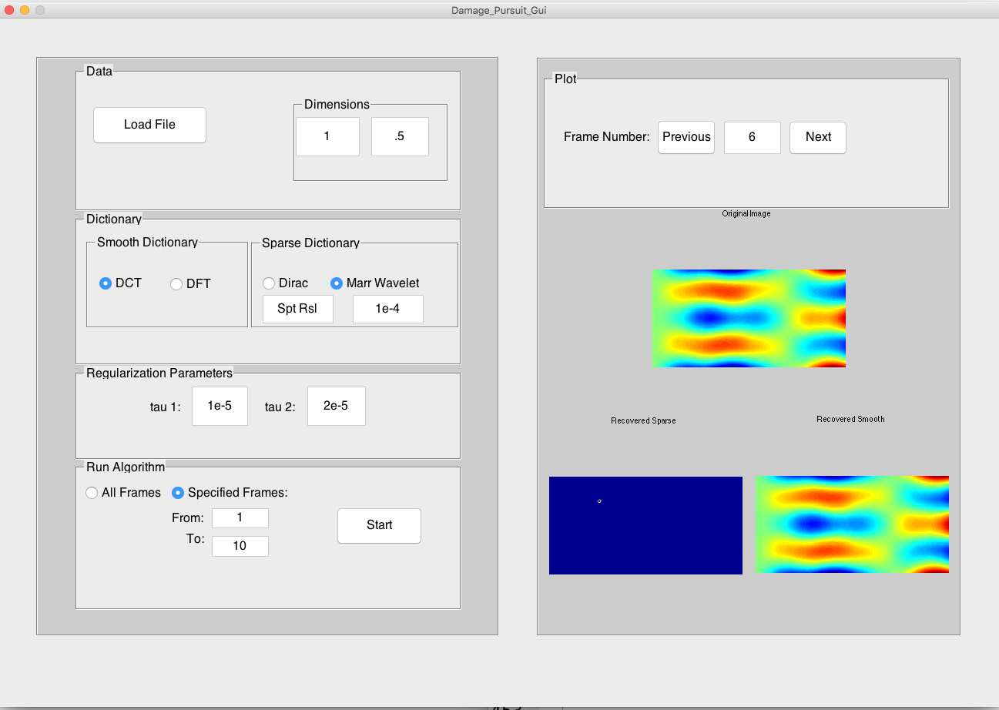
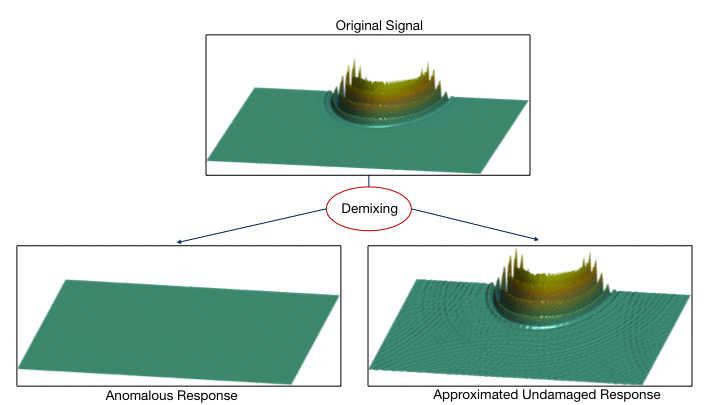

##Damage Pursuit: A MATLAB package for automatic structural defect localization 

Damage pursuit is a Matlab-based software for detecting and triangulating material anomalies in physical
structures. The package takes as input an array of wavefield data (time histories of displacements at a grid of points on a material surface), and returns an image displaying the coordinates of localized defects in the material. The routine requires no prior knowledge of the material properties or characterization of pristine baseline cases, with only minimal user involvement. The Damage pursuit package contains MATLAB GUI as well as command line interface. 

##Principle of Operation

When a solid medium is excited with acoustic waves, the waves propagate through the structure. If defects or anomalous regions are present in the structure, they disturb the incident waves and cause a change in the response of the wavefield in their neighborhoods. The overall wavefield can be thought of a superposition of two components: one component representing the spatially-localized and temporally-persistent features associated with the behavior in close proximity to the defects, and the other approximating the large, smooth features of the response in a hypothetical undamaged medium. Damage Pursuit exploits these structural differences in the components to separate, or “demix,” the wavefield data, as in the example below.

##User Manual
Please read "DamagePursuitManual_19_04_2016.pdf" for detailed user manual. 

##Contributers
This is a collobarative effort with the following contributers:
* Mojtaba Kadkhodaie (http://www.ee.umn.edu/users/kadkh004/index.html)
* Swayambhoo Jain (http://people.ece.umn.edu/users/jainx174/)
* Prof. Jarvis Haupt (http://people.ece.umn.edu/~jdhaupt/)
* Dr. Jeff Druce (https://www.linkedin.com/in/jeff-druce-296135114)
* Prof. Stefano Gonella (http://www.cege.umn.edu/directory/faculty-directory/gonella.html)

##Citation
Please cite the following works if you use this package.
* M. Kadkhodaie, S. Jain, J. Haupt, J. Druce, and S. Gonella, ‘‘Group-level support recovery guarantees for group lasso estimation,’’ Proceedings of International Conference on Acoustics, Speech and Signal Processing, March 2017.
* M. Kadkhodaie, S. Jain, J. Haupt, J. Druce, and S. Gonella,‘‘Locating rare and weak material anomalies by convex demixing of propagating wavefields,’’ IEEE Workshop on Computational Advances in Multi-Sensor Adaptive Processing, December 2015.

